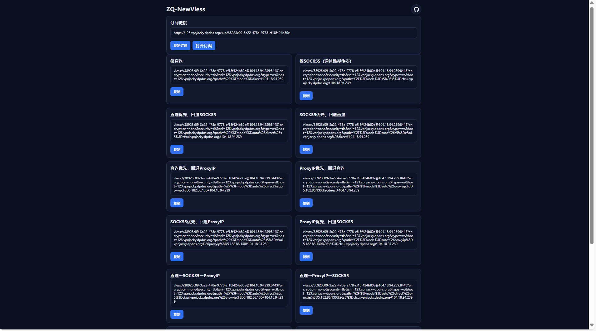
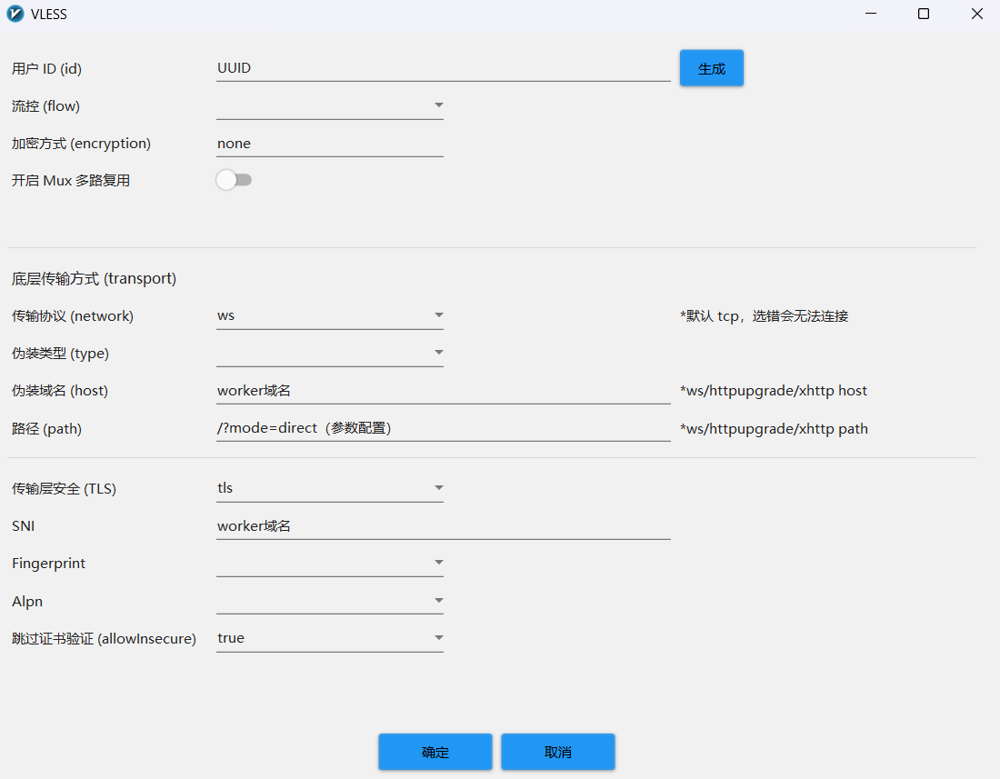

# ZQ-NewVless

## 环境变量

| 名称 | 必填 | 默认值 | 示例 | 说明 |
| --- | --- | --- | --- | --- |
| UUID | 建议填 | ef9d104e-ca0e-4202-ba4b-a0afb969c747 | | VLESS 用户 ID 和访问密码|
| DOMAIN | 否 | 当前 Worker 域名 | - | cloudflare优选域名 |
| PORT | 否 | 443 |  | cloudflare优选域名端口 |
| S5 | 否 | - | user:pass@host:1080 或 host:1080 | SOCKS5 |
| PROXY_IP | 否 |  | proxy.example.com:443或 proxy.example.com|反代cloudflare |
| PROXY_TIMEOUT | 否 | 800 |  | ProxyIP 首字节等待超时（毫秒），超时触发回退（如果proxyip优先的节点无法使用，可调节此值） |
| URL | 否 | https://github.com/BAYUEQI/ZQ-NewVless|  |输入UUID不正确会跳转到这个网址|

## 路径参数（前端会自动生成多种组合）

  * `/?mode=direct`（仅直连）
  * `/?mode=s5&s5=user:pass@host:port`（仅SOCKS5）
  * `/?mode=auto&direct&s5=user:pass@host:port`（直连优先，回退SOCKS5）
  * `/?mode=auto&s5=user:pass@host:port&direct`（SOCKS5优先，回退直连）
  * `/?mode=auto&direct&proxyip=host:port`（直连优先，回退ProxyIP）
  * `/?mode=auto&proxyip=host:port&direct`（ProxyIP优先，回退直连）
  * `/?mode=auto&s5=user:pass@host:port&proxyip=host:port`（SOCKS5优先，回退ProxyIP）
  * `/?mode=auto&proxyip=host:port&s5=user:pass@host:port`（ProxyIP优先，回退SOCKS5）
  * `/?mode=auto&direct&s5=user:pass@host:port&proxyip=host:port`（三者：直连→SOCKS5→ProxyIP）
  * `/?mode=auto&direct&proxyip=host:port&s5=user:pass@host:port`（三者：直连→ProxyIP→SOCKS5）
  * `/?mode=auto&s5=user:pass@host:port&direct&proxyip=host:port`（三者：SOCKS5→直连→ProxyIP）
  * `/?mode=auto&s5=user:pass@host:port&proxyip=host:port&direct`（三者：SOCKS5→ProxyIP→直连）
  * `/?mode=auto&proxyip=host:port&direct&s5=user:pass@host:port`（三者：ProxyIP→直连→SOCKS5）
  * `/?mode=auto&proxyip=host:port&s5=user:pass@host:port&direct`（三者：ProxyIP→SOCKS5→直连）

> 注意：不支持“仅 ProxyIP”模式

## S5/PROXY_IP 填写规范

- S5：
  - 无认证：`host:port`
  - 带认证：`user:pass@host:port`
- PROXY_IP：`host:port` 或 `ip:port`或`ip`

## 手搓节点

## 致谢

本项目参考并基于以下开源项目进行改进与优化：
- workers-vless: https://github.com/ymyuuu/workers-vless
